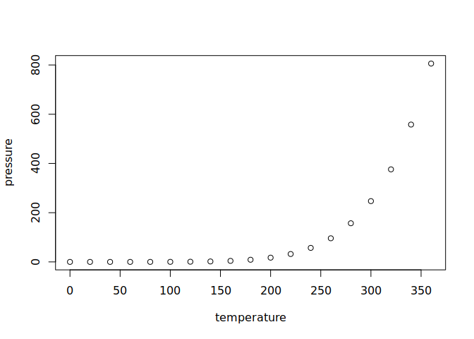

RNASeq自动化报告示例
================

## GitHub Documents

This is an R Markdown format used for publishing markdown documents to
GitHub. When you click the **Knit** button all R code chunks are run and
a markdown file (.md) suitable for publishing to GitHub is generated.

## Including Code

You can include R code in the document as follows:

``` r
summary(cars)
```

    ##      speed           dist       
    ##  Min.   : 4.0   Min.   :  2.00  
    ##  1st Qu.:12.0   1st Qu.: 26.00  
    ##  Median :15.0   Median : 36.00  
    ##  Mean   :15.4   Mean   : 42.98  
    ##  3rd Qu.:19.0   3rd Qu.: 56.00  
    ##  Max.   :25.0   Max.   :120.00

## Including Plots

You can also embed plots, for example:

<!-- -->

## 整个文件目录

``` r
r$> system2("tree")
.
├── config.yaml
├── README.html
├── README.md
├── README.Rmd
├── ref-data
│   ├── download.md
│   ├── mm10
│   │   ├── genome.1.ht2
│   │   ├── genome.2.ht2
│   │   ├── genome.3.ht2
│   │   ├── genome.4.ht2
│   │   ├── genome.5.ht2
│   │   ├── genome.6.ht2
│   │   ├── genome.7.ht2
│   │   ├── genome.8.ht2
│   │   └── make_mm10.sh
│   └── mm10.refGene.gtf.gz
├── RNASeq-downstream-visualization.Rmd
├── sample-data
│   ├── download.sh
│   ├── idname
│   ├── nohup.out
│   ├── SRR12207279.sralite
│   ├── SRR12207280.sralite
│   ├── SRR12207283.sralite
│   └── SRR12207284.sralite
└── Snakefile

3 directories, 24 files
```

## 参考资料

[RNAseq的shell实现](https://cloud.tencent.com/developer/article/2032040?areaSource=103001.3&traceId=QJYAdFlgD1P1-2_Xsv3Z4)
[snakemake基础以及进阶](https://felicia-yjzhang.gitbooks.io/bioinfo-training/content/snakemakeshi-yong.html)  
Rmarkdown教程
